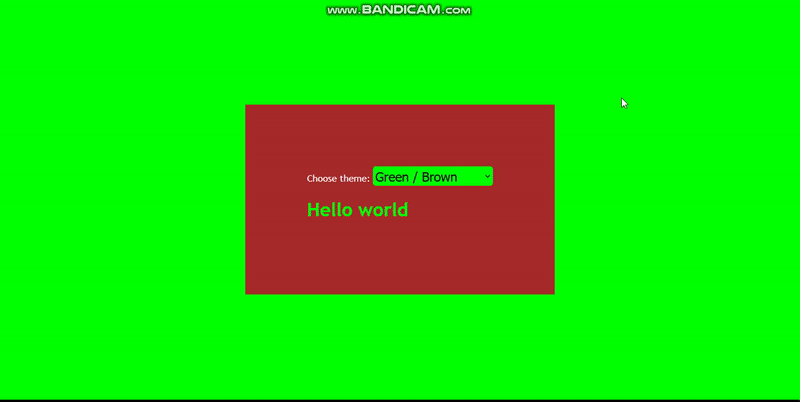

# Color schemes with SASS
It is an exercice to improve my skills in SASS (SCSS syntax)

I create a stylesheet for a website with different color schemes using variables. Using variables to define the main color, background color, and text color for each scheme. Practice switching between color schemes by changing the variable values.
<br>
# 🙂 Overview 
<p align="center">
	
</p>

# 🧷 Some details in SASS file
To make it easier to switch between color schemes, I can create a mixin that takes arguments for the different color values. I add this mixin to the main.scss file:
```scss
	@mixin color-scheme($main-color, $body-background-color, $text-color, $main-content-bg){
		body {
			margin: 0;
			background-color: $body-background-color;
			color: $text-color;
			@include font-family('Trebuchet MS');
		}

		h1 {
			color: $main-color;
		}

		.content {
			height: 100vh;
			@include d-flex(center, center);
		}

		.main-content {
			padding: calc(4vw + 50px);
			background-color: $main-content-bg;
		}
	}
```

 I apply the `color-scheme` mixin with different color values to create multiple color schemes. Here's an example:
 ```scss
 	.black-pink {
			@include color-scheme(pink, pink, white, black);	
			@include select-color(pink, black);
		}
 ```
<br><br>

 ## Don't forget to give a star ⭐ by pressing the start button if you like this exercise. 👋